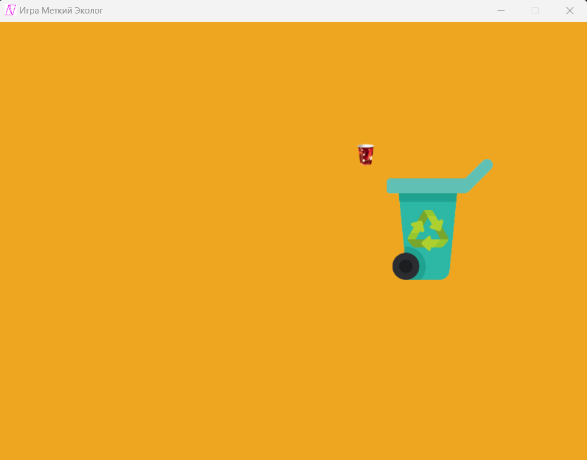

# Игра "Убери мусор в корзину"

## Описание
"Убери мусор в корзину" — это игра, созданная на языке Python с использованием библиотеки Pygame. Цель игры — управлять пластиковым стаканчиком и попытаться попасть им в мусорный бак, который перемещается по экрану. Игрок управляет стаканчиком, перемещая его мышкой.

## Управление
Наводим курсор в виде стаканчика на корзину и нажимаем ЛКМ

## Цель игры
Попасть пластиковым стаканчиком в мусорный бак.

## Установка
1. Убедитесь, что у вас установлен Python 3.x.
2. Установите Pygame:
    ```bash
    pip install pygame
    ```
## Дополнительные материалы
[Урок на Zerocoder University](https://university.zerocoder.ru/pl/teach/control/lesson/view?id=323446783)

## Скриншоты

!
## Используемые технологии
- Python
- Pygame

## Лицензия
Проект распространяется под лицензией MIT.
